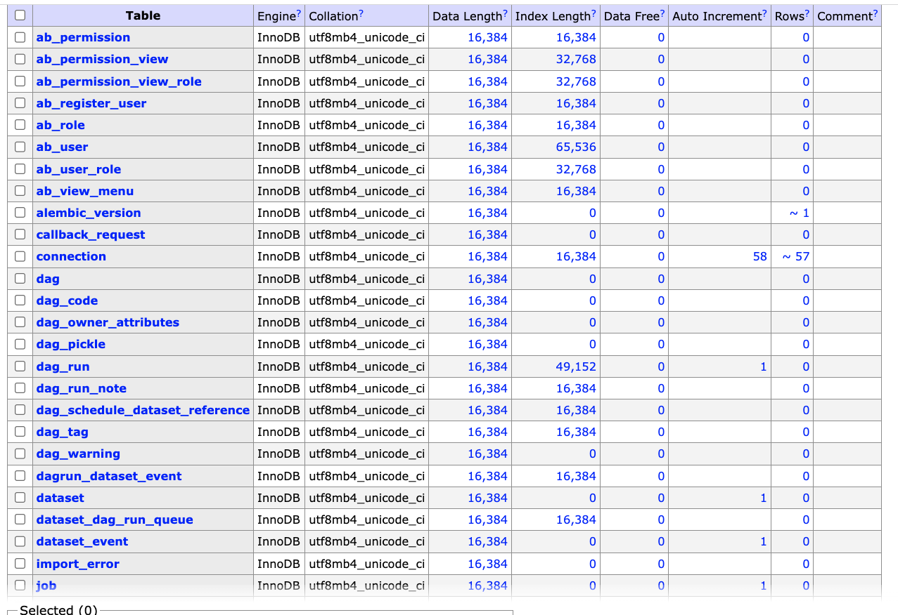

g# The Book, Data Pipeline Pocket Reference [Code Practice]

This repo is about my personal code practices that I followed along the code exercises from the book, ["Data Pipelines Pocket Reference"](https://www.oreilly.com/library/view/data-pipelines-pocket/9781492087823/) written by ['James Densmore'](https://www.linkedin.com/in/jamesdensmore/)
<br>
<br>

-----


## Local Running
### 1. Initial Setup
1) Create a virtual environment

   for linux(Mac) user
   ```
   python3 -m venv .venv
   ```
   
   for window user
   ```
   py -m venv
   
   ```
   
2) Activate the virtual environment

   for linux(Mac) user
   ```
   source .venv/bin/activate
   ```
   
   for window user
   ```
   .venv\Scripts\activate.bat
   
   ```
   
3) Install packages in the virtual environment
   
   ```
   pip install -r requirements.txt
   ```

-----

### 2. MySQL Database
You can install MySQL on your local computer, but I set up the database with docker.
Please refer to [database/docker-compose.yml](database/docker-compose.yml).
<br>
<br>
### 3. AWS Redshift Serverless Setup & Python Connection
Please refer to the following documentations:
- [documentation/01_aws_redshift_serverless_setup.md](documentation/01_aws_redshift_serverless_setup.md)
- [documentation/02_aws_redshift_serverless_python_connection.md](documentation/02_aws_redshift_serverless_python_connection.md)


### 4. PostgresSQL Database
As with MySQL database, there are several ways to create PostgresSQL database, but I used AWS RDS service. Learn [how to create and connect a PostgresSQL Database with Amazon RDS](https://aws.amazon.com/getting-started/hands-on/create-connect-postgresql-db/).


### 5. MongoDB Atlas
Atlas is a fully managed MongoDB service and includes a free-for-life tier with plenty of storage and computing power for learning and running samples. The code example of 'Extracting Data from MongoDB' in this book uses MongoDB Atlas, so I also used it for this practice.
Learn [how to install the Atlas CLI and set up the Atlas](https://www.mongodb.com/docs/atlas/cli/stable/). I created my database and collection using Mongo DB Atlas Console. 

   - How to Fix Error: `[SSL: CERTIFICATE_VERIFY_FAILED] certificate verify failed: unable to get local issuer certificate`

      **Original code for MongoClient in the book**
      ```
      mongo_client = MongoClient(
                "mongodb+srv://" + username
                + ":" + password
                + "@" + hostname
                + "/" + database_name
                + "?retryWrites=true&"
                + "w=majority&ssl=true&"
                + "ssl_cert_reqs=CERT_NONE")
      ```

      However, for me it raised the error mentioned above, so I used the following code to fix the issue.(`certifi` should be installed and imported to your python script.)

      ```
      mongo_client = MongoClient(
         f"""mongodb+srv://{username}:{password}@{username.lower()}.y7gdbex.mongodb.net/?retryWrites=true&w=majority""",
         tlsCAFile = certifi.where()
         )
      ```
      For whole code, please refer to [sample_mongodb.py](sample_mongodb.py)
### 6. REST API
The REST API that the code exercise of the book is using is [Open Notify](http://open-notify.org/)'s iss-pass endpoint. However, it is no longer available, so instead I used [Sunrise and Sunset](https://documenter.getpostman.com/view/8854915/Szf7znEe#bb7236b2-536e-4bdc-bfa2-fbe2fe1941eb) Public API in [REST_API_extract.py](REST_API_extract.py).

### 7. Configuring a Snowflake Storage Integration to Access Amazon S3
As one of the options for configuring access to the S3 bucket from a Snowflake instance, the author of this book recommended **a Snowflake storage integration**, so I selected the option. Regarding how-to, please refer to [the latest Snowflake documentation](https://docs.snowflake.com/en/user-guide/data-load-s3-config-storage-integration)

- For initial setup of snowflake data warehouse
   After you create Snowflake account and login, you need to do initial setup on Snowflake, which is the sql query.
   You can run the [sql query](database/snowflake_setup_sql.txt) on Snowflake console. 

### 8. Data Modeling
Please run the codes in the following order.
   1. [1_data_modeling_table_creation.py](1_data_modeling_table_creation.py)
   2. [2_data_modeling.py](2_data_modeling.py)
   3. [3_data_modeling_scd-for-fully-refreshed-data.py](3_data_modeling_scd-for-fully-refreshed-data.pygit)

### 9. Apache Airflow Installation
I installed airflow on my virtual environment following the instruction on [How to Install Apache Airflow on Windows without Docker](https://www.freecodecamp.org/news/install-apache-airflow-on-windows-without-docker/) written by Aviator Ifeanyichukwu.

**Errors handling**

The installed `pydantic` library didn't work, so I uninstall it and reinstall lower version.
   ```
   pip uninstall pydantic
   pip install pydantic==1.10.7.
   ```

According to warning message when installing `pydantic==1.10.7`, I also installed `apache-airflow cncf.kubernetes`.

   ```
   pip install apache-airflow-providers-cncf-kubernetes
   ```

In `Step 4. Create an Airflow User` of [How to Install Apache Airflow on Windows without Docker](https://www.freecodecamp.org/news/install-apache-airflow-on-windows-without-docker/), some flags are written with one dash (e.g. -password), but please make sure to add two dashes (e.g. --password).

Regarding setting airflow home, I ran the following code on command line prompt.
```
export AIRFLOW_HOME=~/airflow
```

**Run the Webserver**
1. Run the scheduler.
   ```
   airflow scheduler
   ```
2. Launch another terminal, activate the virtual environment if it isn't.
cd to $AIRFLOW_HOME, and run the webserver
   ```
   airflow webserver
   ```

   If you are using the port 8080 for something else, change the port for airflow by typing.
For example, I assigned 8090 instead.
   ```
   airflow webserver --port 8090
   ```

3. Open `localhost:8090` on your web browser and log in to the user interface using the user name created earlier with "airflow users create".

   - You can terminate `airflow scheduler` & `airflow webserver` by simply hitting `Ctrl + C` on command line prompt.

**Setting up a database**

Airflow uses a datase to store the followings:
   - all the metadata related to the execution history of each task and DAG 
   - your Airflow configuration

By default, Airflow uses a SQLite database. With `airflow db init` command, Airflow also creates a SQLite database for you. For a small-scale project, that's just fine. However, for larger scale needs the author suggests using a MySQL or Postgres database.

Airflow uses Sql Alchemy library behind the scenes and can easily be reconfigured to use such a database instead of SQLite.

[How to Setup a Database Backend with Airflow](https://airflow.apache.org/docs/apache-airflow/stable/howto/set-up-database.html#database-uri)
   1) MySQL Database for Airflow

      I chose a MySQL database for this, so I replaced `sql_alchemy_conn` with mysql connection string on `airflow.cfg` in airflow folder. (`cd ~/airflow` -> `nano airflow.cfg` )
      Originally, I tried the following connection string, but it didn't work for me.
      ```
      sql_alchemy_conn = mysql+mysqldb://<user>:<password>@<host>[:<port>]/<dbname>
      ```
      Instead, I installed `mysqlconnector` by  running
      ```
      pip insatall mysql-connector-python
      ```
      And replaced `sql_alchemy_conn` with the following.
      ```
      mysql+mysqlconnector://<user>:<password>@<host>[:<port>]/<dbname>
      ```
      When I access my mysql datadase with `pymysql` library, the port number of mysql adminer docker container, which is 8080, but it didn't work for this case. When I changed the port to 3306, which is mysql docker container, the connection was successful.

      When reinitializing the Airflow database in MySQL with the following command

      ```
      airflow db init
      ```
         **Tables created on airflow_db after running `airflow db init`**
         If you check the database, airflow_db on MySQL adminer UI, you can see the tables (in my case, 42 tables) have created. You will be able to see all your airflow metadata here. You can query data on airflow activity, so there is no better way to analyse the performance of your pipeline.

         </img>

**Email notification on Dag Failure**
1. Set up at Gmail account
   
   - Enable IMAP
   1) Go to gmail setting (gear symbol on top right) 
      -> see all settings 
   2) Select 'Forwarding and POP/IMAP' tab
   3) Scroll down and find 'IMAP access' and tick 'Enable IMAP'
   </img>
   4) Save the change
      Now you allowed other clients to access Gmail using IMAP
   
   - Generate GoogleApp Password
   5) Go to [your app password](https://security.google.com/settings/security/apppasswords). You may be asked to sign in to your google account.
   6) Click 'Select app' and choose 'email'
   7) Click 'Select Device' and choose 'custom'
   8) Name the device, for example, 'airflow' and click 'Generate'
   9) Copy the app password

   - Edit airflow.cfg
   10) Open `~/airflow/airflow.cfg`
   11) Find [smtp] section and edit as below.
         ```
         smtp_host = smtp.gmail.com
         smtp_starttls = True
         smtp_ssl = False
         smtp_user = [ your id ]@gmail.com
         smtp_password = [copied app password. see 9. above]
         smtp_port = 25
         smtp_mail_from = airflow@example.com
         smtp_timeout = 30
         smtp_retry_limit = 5
         ```
   12) save the change

2. Add email argument on Dag

   For the code example, please refer to [elt_pipeline_sample/elt_pipeline_sample.py](elt_pipeline_sample/elt_pipeline_sample.py) which is my dag description file.


### 10. Others
- Kafka & Debezium

   The book briefly mentions **Kafka and Debezium** as a recommended solution for ingesting data from a CDC system such as MySQL binlogs or Postgres WALs. However, there was no exercise example for that. It is good to explore them. [debesizum tutorial](https://debezium.io/documentation/reference/1.2/tutorial.html).

   ###### CDC (Change Data Capture): the tracking of all changes in a data source (database, data warehouse, etc) so they can be captured in destination systems


