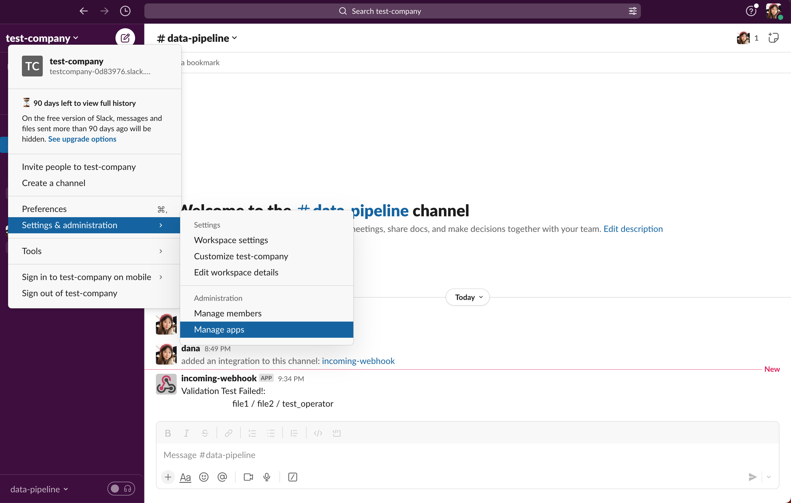
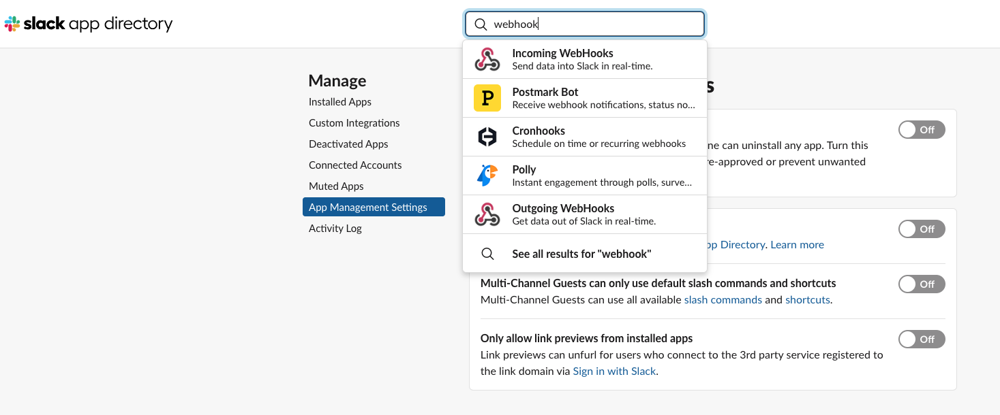

# Running Validation Test

1. Activate a virtual environment

    ```
    source .env/bin/activate
    ```
2. Move to data_validation folder
    ```
    cd data_validation
    ```
3. Run a validation test to see if two tables have the same numer of rows
    ```
    python validation.py order_count.sql order_full_count.sql equals halt
    ```
4. Run a validation test to see if there is no duplicate record after ingestion
    ```
    python validation.py order_count.sql order_full_count.sql equals halt
    ``` 
5. Run a validation test to see if there is an unexpected change in row count after ingestion
    ```
    python validation.py order_yesterday_zscore.sql zscore_90_twosided.sql greater_equals halt
    ``` 
    [Caution] [data_validation/validation.py](data_validation/validation.py) commented out `WHERE` clause that filters the z-score of yesterday's order count as the the table, Order doesn't include the data of yesterday. Instead it is to show z-score of the order date '2020-07-12', which is the latest order date of [the table Orders we populated](elt_pipeline_sample/create_populate_tables.py).

    **Understanding of Z score**
    Z score is a statistical measurement that shows how distant a certain value is from the average value of historical data in terms of standard deviation. For example, if the average daily order count over the last 1 year is 10 and yesterday's order count was 20, the distance is 10. If the standard deviation of this order count distribution is 2, the distance is 5 times the standard deviation. 5 is z score.

    - Why do we compares with the z score 1.645 in [data_validation/zscore_90_twosided.sql](data_validation/zscore_90_twosided.sql)? 

        If you look at [z score percentile distribution table](https://www.mymathtables.com/statistic/z-score-percentile-normal-distribution.html), you can see that the absolute value of 5 percentile and 95 percentile is 1.645. 
        
            Why 5 or 95 percentile? not 90 percentile? 
            
            It is because it is two-tailed test because we are looking under both sides of a normal distribution curve. As this exercise considers the yesterday's order count as the extreme number when it's located outside 90 percentile of the historical order count distribution.
6. Run a validation test to see if there is an unexpected change in metric value such as revenue
    ```
    python validation.py revenue_yesterday_zscore.sql zscore_90_twosided.sql greater_equals halt
    ``` 

# Send Slack Notification on Dag Failure

1. Setting at Your Slack Channel 
   By adding webhooks to your slack channel, you can send message to your slack channel.
   1) in your slack channel, go to `Setting & administration` and select `manage apps`
   
   2) go to `App Management Setting` ans search `Incoming Webhooks`.
   
   3) copy the webhook url

2. Paste the webhook url into your `pipeline.conf`
3. Run `test_slack.py` if you can send message to your slack using the webhook url

    ```
    cd data_validation
    ```

    ```
    python test_slack.py file1 file2 equals True
    ```
    For this test, `file1`, `file2`, and `equals` can be any names, but the last one should `True` or `False`.
    When the value of the last argument is `True`, it will send success message to your slack, failure mesage with `False` input.


# Add Validation Test Task (with Slack Notification on Test Failure) on the Date Pipeline Dag

[data_validation/elt_pipeline_sample_with_validation.py](data_validation/elt_pipeline_sample_with_validation.py) is the updated dag description file for ELT pipeline sample. Copy this file to your dag folder.

```
cd data_validation
```

```
cp elt_pipeline_sample_with_validation.py ~/airflow/dags
```
